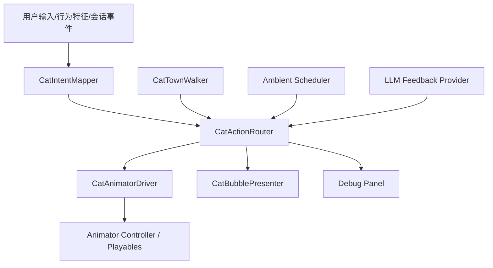
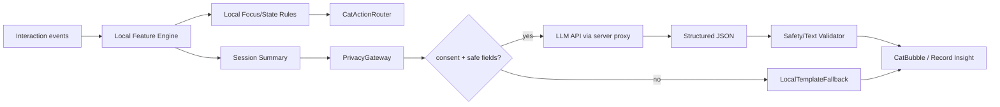

# CatLife 猫咪动作编排与大模型接入落地方案

日期：2026-07-02

适用工程：`work/CatLife_Unity_Main/`

用途：基于当前已经导入 Unity 的猫咪动画、主场景、小镇行走脚本、行为识别方案和大模型隐私降级方案，定义一套可直接开发的猫咪动作编排、用户交互触发、连续行走、状态驱动和大模型接入方案。

> 2026-07-04 更新：深度研究报告已经转化为 `07-tech-specs/CatLife_识别模块与猫咪自由行为驱动落地方案_20260704.md`。后续从局部 `CatTownWalker` 升级到 NavMesh 全场自由行走、Recognition、`CatBehaviorDriver`、`CatAnimationController` 和 Prompt/LLM mock 时，以该新文档作为当前实施入口；本文继续作为动作语义和大模型产品策略依据。

## 1. 当前资产基线

### 1.1 Unity 当前已存在内容

| 项 | 当前文件/对象 | 当前状态 |
|---|---|---|
| 主场景 | `Assets/Scenes/MainScene.unity` | 小镇、猫、首页 UI、相机控制已进入主场景 |
| 猫对象 | `CatLifeMainRoot/Characters/CatCompanionModel` | 已在场景中，已挂 Animator 和 `CatTownWalker` |
| 行走脚本 | `Assets/Scripts/Cat/CatTownWalker.cs` | 已支持随机目标点、转向、Walk/Idle 切换 |
| 行走装配器 | `Assets/Editor/CatLifeCatTownWalkerSetup.cs` | 已生成 walk clip、Animator Controller、猫位置/缩放/移动范围 |
| 当前 Animator | `Assets/Art/Cat/Animator/CatLife_TownWalker.controller` | 只有 `Idle` + `Walk` 两个状态，参数为 `IsWalking` |
| 动作清单 | `Assets/Art/Cat/Animations/cat_actions_manifest.json` | 记录 10 个站立/原地状态动作 |
| 动作 clip | `Assets/Art/Cat/Animations/Clips/*.anim` | 10 个表情动作 + 1 个 walk 动作已存在 |
| UI/相机 | `Assets/Scripts/UI/`、`Assets/Scripts/Camera/` | 已有右侧旋转按钮、滑槽、相机旋转脚本 |

### 1.2 当前动作资产清单

| 动作 ID | Clip | 帧数/意图 | 当前可用性 | 适合用途 |
|---|---|---|---|---|
| `idle_breath` | `CL_CAT_IdleBreath_v06_headsync_loop_108f` | 慢呼吸 idle | 已接受 | 默认、专注低刺激、无操作陪伴 |
| `alert_look` | `CL_CAT_AlertLook_v01_loop_120f` | 警觉环顾 | 已接受 | 返回 App、分心上升、用户快速操作 |
| `paw_wave` | `CL_CAT_PawWave_v01_loop_96f` | 轻微挥爪 | 已接受 | 点击猫、奖励、欢迎 |
| `tail_wag_happy` | `CL_CAT_TailWagHappy_v01_loop_96f` | 开心摆尾 | 已接受 | 普通状态、奖励、正反馈 |
| `curious_sniff` | `CL_CAT_CuriousSniff_v02_loop_112f` | 低头轻嗅 | 已接受 | 点击地面/道具、停下探索 |
| `head_tilt_listen` | `CL_CAT_HeadTiltListen_v01_loop_96f` | 歪头倾听 | 已接受 | 用户点记录/猫咪/气泡、LLM 文案出现 |
| `look_back` | `CL_CAT_LookBack_v02_loop_112f` | 回头看 | 已接受 | 相机旋转、走到边界、用户从背后视角观察 |
| `stretch_yawn` | `CL_CAT_StretchYawn_v03_slow_loop_264f` | 慢伸懒腰 | 已接受 | 长 idle、专注结束前后、奖励前奏 |
| `ear_twitch_alert` | `CL_CAT_EarTwitchAlert_v02_loop_120f` | 耳朵警觉 | 已接受 | 轻微分心、后台返回、快速滑动 |
| `head_shake_no` | `CL_CAT_HeadShakeNo_v01_loop_108f` | 摇头否定 | 待复核但可接入低频 | 过度点击、频繁退出、隐私/无效操作反馈 |
| `walk` | `CL_CAT_SRC_Walk_60fps` | 60fps 行走 | 已接入当前 controller | 持续移动、巡游、靠近目标 |

### 1.3 关键限制

当前 10 个状态动作本质上都是站立、原地或近原地循环动作，不要在首版里把它们宣传成趴下、睡觉、坐下、跳跃或复杂互动。

当前缺少这些动作：

| 缺口 | 是否阻塞 MVP | 临时替代 |
|---|---:|---|
| 坐下 | 不阻塞 | `idle_breath` 降速 + 停止移动 |
| 趴下/睡觉 | 不阻塞 | `idle_breath` 降速 + 降低 UI 干扰 |
| 明确喵叫 | 不阻塞 | 文字气泡 + `head_tilt_listen` |
| 奖励跳跃 | 不阻塞 | `tail_wag_happy` + `paw_wave` + 奖励 UI |
| 生气/拒绝 | 不阻塞 | `head_shake_no` 低频使用 |

## 2. 动作系统总体原则

### 2.1 设计目标

猫咪动作不只是“随机播放动画”，而是承担四个产品功能：

| 功能 | 说明 |
|---|---|
| 生命感 | 没有用户操作时，猫也会走路、停下、呼吸、轻微观察 |
| 注意状态反馈 | 用户从活跃到安静时，猫动作同步变慢、变稳 |
| 轻陪伴 | 专注中不要频繁打扰，动作频率降低 |
| 可解释性 | 用户点击某处或状态变化时，猫的动作要能解释“它为什么这么做” |

### 2.2 行业高效率规范

| 规范 | CatLife 落地方式 |
|---|---|
| 本地优先 | 行为评分和动作选择都在本地完成，网络失败不影响猫动作 |
| 低延迟主循环 | 每帧只做轻量状态更新；LLM 请求异步、低频、不可阻塞 Unity 主线程 |
| 配置驱动 | 动作映射、冷却、优先级、触发条件写进表，不散落硬编码 |
| 明确仲裁 | 所有动作请求先进入 `CatActionRouter`，按优先级、冷却、可打断性决策 |
| 最少 Animator 复杂度 | P0 使用单层状态机；如果后续加层，保持层数最少，避免无用 layer 每帧评估 |
| 不频繁 Rebind | 不在运行时反复换 RuntimeAnimatorController，不频繁调用 Animator Rebind |
| 结构化 LLM 输出 | LLM 只返回固定 JSON schema，Unity 只接受白名单动作建议和短文案 |
| 隐私最小化 | 不上传文本原文、截图、原始坐标轨迹、跨 App 内容 |
| 可观测 | Debug 面板显示当前状态、动作队列、上次触发原因、LLM 来源和降级状态 |

## 3. 动作层级架构

### 3.1 推荐架构



模块职责：

| 模块 | 职责 | 是否 P0 |
|---|---|---:|
| `CatTownWalker` | 控制猫在小镇里移动、转向、是否行走 | 是 |
| `CatIntentMapper` | 把用户操作、状态分数、UI 事件转为动作意图 | 是 |
| `CatActionRouter` | 动作优先级、冷却、排队、打断判断 | 是 |
| `CatAnimatorDriver` | 只负责播放具体 Animator state/trigger | 是 |
| `Ambient Scheduler` | 无操作时自然触发 idle 动作 | 是 |
| `CatBubblePresenter` | 显示本地或 LLM 文案 | P1 |
| `LLM Feedback Provider` | 会话后/低频生成陪伴解释 | P1 |
| `Debug Panel` | 展示状态和动作证据 | P1，比赛演示建议做 |

### 3.2 Animator 实现路线

P0 不建议立刻做复杂多层 Animator。原因是当前 rig 是 Generic，clip 多为全身站立动作，如果强行 upper-body mask，容易出现绑定不完整、动作互相污染、调试成本高。

| 阶段 | 实现方式 | 用途 | 进入条件 |
|---|---|---|---|
| P0 | 单层 Animator Controller | 先稳定接入 Walk + Idle + 10 个 reaction state | 当前工程即可做 |
| P1 | 单层 + 动作队列 | 停下时播放 reaction，行走时只排队 | P0 稳定后 |
| P2 | Playables one-shot | 用脚本动态混合短动作，减少 Animator 图复杂度 | clip 绑定稳定、需要更自然混合时 |
| P3 | Avatar Mask / 多层 | 只在确认骨骼 mask 对 Generic rig 可靠后使用 | 需要头部/耳朵动作叠加在 walk 上 |

P0 Animator 参数：

| 参数 | 类型 | 说明 |
|---|---|---|
| `IsWalking` | bool | 移动速度超过阈值时为 true |
| `ActionId` | int | 当前 reaction 动作枚举 |
| `PlayAction` | trigger | 请求播放 reaction |
| `Mood` | int | 0 Normal、1 Transition、2 Focus、3 Reward |
| `ActionSpeed` | float | 可选，用于 Focus 时降速 idle |

动作状态命名建议：

| ActionId | State 名 | Clip |
|---:|---|---|
| 0 | `IdleBreath` | `CL_CAT_IdleBreath_v06_headsync_loop_108f` |
| 1 | `AlertLook` | `CL_CAT_AlertLook_v01_loop_120f` |
| 2 | `PawWave` | `CL_CAT_PawWave_v01_loop_96f` |
| 3 | `TailWagHappy` | `CL_CAT_TailWagHappy_v01_loop_96f` |
| 4 | `CuriousSniff` | `CL_CAT_CuriousSniff_v02_loop_112f` |
| 5 | `HeadTiltListen` | `CL_CAT_HeadTiltListen_v01_loop_96f` |
| 6 | `LookBack` | `CL_CAT_LookBack_v02_loop_112f` |
| 7 | `StretchYawn` | `CL_CAT_StretchYawn_v03_slow_loop_264f` |
| 8 | `EarTwitchAlert` | `CL_CAT_EarTwitchAlert_v02_loop_120f` |
| 9 | `HeadShakeNo` | `CL_CAT_HeadShakeNo_v01_loop_108f` |
| 10 | `Walk` | `CL_CAT_SRC_Walk_60fps` |

## 4. 动作请求模型

所有动作都用统一请求结构，避免每个按钮直接操作 Animator。

```json
{
  "request_id": "local-uuid",
  "source": "user_tap_cat",
  "action_id": "head_tilt_listen",
  "priority": 60,
  "interrupt_policy": "queue_if_walking",
  "cooldown_sec": 8.0,
  "max_delay_sec": 4.0,
  "reason": "user tapped cat head",
  "bubble_key": "cat_listening",
  "created_at_ms": 1782970000000
}
```

字段定义：

| 字段 | 说明 |
|---|---|
| `source` | `ambient`、`user`、`behavior_state`、`session`、`llm`、`system` |
| `action_id` | 必须来自动作白名单 |
| `priority` | 数字越大越优先 |
| `interrupt_policy` | `play_now`、`queue_if_walking`、`drop_if_busy`、`replace_ambient` |
| `cooldown_sec` | 同一动作最短间隔 |
| `max_delay_sec` | 排队超过此时间就丢弃，避免延迟反应不合理 |
| `bubble_key` | 本地气泡模板 key；LLM 只能补充文案，不能绕过动作白名单 |

优先级：

| 优先级 | 来源 | 示例 |
|---:|---|---|
| 100 | 系统保护 | 越界回收、Animator 错误恢复 |
| 90 | 会话主流程 | 开始专注、完成专注、退出专注 |
| 70 | 用户直接点击猫 | 点猫头、长按猫、点地面 |
| 60 | UI 功能反馈 | 点记录、设置、旋转按钮 |
| 50 | 行为识别状态 | 进入 Transition、Focus、Reward |
| 30 | LLM 文案联动 | LLM 生成一句鼓励后歪头听 |
| 10 | ambient 自然动作 | 随机摆尾、嗅探、伸懒腰 |

仲裁规则：

| 条件 | 处理 |
|---|---|
| 正在 Walk 且请求为 ambient | 直接丢弃或排队到下一次停下 |
| 正在 Walk 且请求为用户点猫 | 优先排队；如果 2 秒内还在走，则短暂停下播放 |
| 正在播放 Reward | 不被低优先级动作打断 |
| 同一动作在 cooldown 内再次触发 | 丢弃，更新 Debug 计数 |
| LLM 返回未知动作 | 忽略动作，只展示通过审核的文案或本地模板 |
| 行为状态快速抖动 | 状态驻留至少 3 秒后才发动作请求 |

## 5. 无用户行为识别时的猫咪生命感

在行为识别和 Android 事件桥未接入前，猫必须已经显得“活着”。P0 可以只靠本地 scheduler。

### 5.1 默认循环

| 场景 | 走路策略 | 停留策略 | 动作策略 |
|---|---|---|---|
| 首页普通状态 | 走 4-9 秒 | 停 0.8-2.2 秒 | 停下后 35% 概率播一个 ambient |
| 用户 10 秒无操作 | 走路频率下降 | 停 2-5 秒 | `idle_breath` 为主，低频 `curious_sniff` |
| 用户 30 秒无操作 | 小范围慢走 | 停 5-12 秒 | 偶发 `stretch_yawn`，不连续打扰 |
| 专注准备卡打开 | 停止远距离移动 | 贴近中心安全区 | `head_tilt_listen` 或 `idle_breath` |
| 专注中 | 不主动巡游或极小范围移动 | 长停留 | `idle_breath` 降速，极低频 `ear_twitch_alert` |

### 5.2 Ambient 权重

| 状态 | 候选动作 | 权重 | 最短间隔 |
|---|---|---:|---:|
| Normal | `tail_wag_happy` | 20 | 12s |
| Normal | `curious_sniff` | 24 | 10s |
| Normal | `head_tilt_listen` | 16 | 12s |
| Normal | `look_back` | 10 | 18s |
| Normal | `stretch_yawn` | 6 | 45s |
| Normal | `alert_look` | 10 | 18s |
| Transition | `head_tilt_listen` | 28 | 12s |
| Transition | `ear_twitch_alert` | 18 | 15s |
| Transition | `idle_breath` | 34 | 0s |
| Focus | `idle_breath` | 80 | 0s |
| Focus | `ear_twitch_alert` | 5 | 45s |
| Focus | `stretch_yawn` | 3 | 90s |
| Reward | `tail_wag_happy` | 35 | 8s |
| Reward | `paw_wave` | 35 | 8s |
| Reward | `stretch_yawn` | 10 | 45s |

### 5.3 反重复规则

| 规则 | 数值 |
|---|---:|
| 同一 reaction 连续播放上限 | 1 次 |
| 最近 3 个 reaction 中不能重复超过 | 2 次 |
| ambient 触发总频率 | 首页最多 1 次 / 6 秒 |
| Focus ambient 触发总频率 | 最多 1 次 / 45 秒 |
| 用户触发动作反馈延迟 | 0-300ms，如果正在走则最多排队 2 秒 |

## 6. 用户操作与动作映射

### 6.1 首页点击区域

| 用户操作 | 事件 | 猫动作 | UI/文案 | 限制 |
|---|---|---|---|---|
| 单击猫头 | `tap_cat_head` | `head_tilt_listen` | “嗯？我在听。” | 8 秒冷却 |
| 单击猫身体 | `tap_cat_body` | `tail_wag_happy` | “我会陪你一会儿。” | 8 秒冷却 |
| 双击猫 | `double_tap_cat` | `paw_wave` | 显示短气泡 | 12 秒冷却 |
| 2 秒内点击猫 4 次以上 | `tap_burst_cat` | `head_shake_no` | “慢一点，我还在这里。” | 20 秒冷却，不责备 |
| 长按猫 600ms | `long_press_cat` | `curious_sniff` 或 `head_tilt_listen` | 气泡展开 | 12 秒冷却 |
| 点击猫附近地面 | `tap_ground_near_cat` | 猫走向安全点，停下后 `curious_sniff` | 无或短气泡 | 目标点必须在可见区 |
| 点击远处建筑 | `tap_town_prop` | `look_back`，可选走近 | 显示建筑名或功能提示 | P1 做，P0 不强依赖 |

### 6.2 主功能按钮

| 按钮/操作 | 猫动作 | 说明 |
|---|---|---|
| 点击 `开始专注` | `head_tilt_listen` -> 进入准备卡后 `idle_breath` | 猫像是在听用户准备开始 |
| 确认开始专注 | `stretch_yawn` 或 `idle_breath` 降速 | 没有趴下动作前，使用慢伸展作为进入安静状态 |
| 点击 `猫咪` | `tail_wag_happy` 或 `paw_wave` | 进入猫状态页，猫可以开心回应 |
| 点击 `记录` | `head_tilt_listen` | 像在听复盘，不要用奖励动作 |
| 点击 `设置` | `alert_look` 或 `head_tilt_listen` | 设置页不应太活跃 |
| 长按旋转按钮 | `look_back` 仅触发一次 | 避免拖动过程中每帧触发动作 |
| 旋转按钮水平拖动 | 保持 walk/idle，不重复触发 reaction | 相机操作优先保证画面稳定 |
| 上下滑槽拖动 | `ear_twitch_alert` 可低频触发 | 只在第一次长按后触发 |

### 6.3 操作频率与行为反馈

| 行为特征 | 阈值 | 状态倾向 | 猫动作 |
|---|---:|---|---|
| 1 秒内 tap >= 4 | `tap_rate_1s >= 4` | Arousal 上升 | `ear_twitch_alert`；持续则 `head_shake_no` |
| 5 秒内 tap >= 10 | `tap_rate_5s >= 2/s` | 分心/焦躁候选 | `alert_look`，UI 不弹强提醒 |
| 30 秒内页面切换 >= 4 | `page_switch_rate_30s >= 4` | Distraction 上升 | `look_back` 或 `head_shake_no` |
| 连续 8 秒低操作 | `idle_duration >= 8s` | Transition | `head_tilt_listen` -> `idle_breath` |
| 连续 30 秒低操作且分心低 | `focus_score >= 70` | Focus | `idle_breath` 降速，停止远距离巡游 |
| Focus 中轻微点击 1-2 次 | `distraction_score < 35` | 轻微分心 | `ear_twitch_alert`，不退出 |
| Focus 中 5 秒高频操作 | `distraction_score >= 65` | 退出候选 | `alert_look`，显示确认而不是强退 |
| 会话完成 | `focus_session_completed` | Reward | `stretch_yawn` -> `tail_wag_happy` -> `paw_wave` |

## 7. 四状态动作搭配

### 7.1 Normal

目标：猫活泼但不过度抢注意力。

| 维度 | 规则 |
|---|---|
| 移动 | 在相机安全区持续巡游，走 4-9 秒、停 0.8-2.2 秒 |
| 基础动画 | 走路时永远播放 `walk`，停下回 `idle_breath` |
| ambient | 停下后随机 `curious_sniff`、`tail_wag_happy`、`head_tilt_listen` |
| 用户互动 | 点击猫优先反馈，快速连点进入 `head_shake_no` 冷却 |
| UI | 右侧按钮和 CTA 全部显示 |

推荐动作序列：

```text
Walk 6s -> IdleBreath 1s -> CuriousSniff 1.8s -> Walk 5s -> IdleBreath -> TailWagHappy
```

### 7.2 Transition

目标：用户操作开始变少时，猫变得安静、靠近、像在陪用户进入状态。

| 维度 | 规则 |
|---|---|
| 触发 | 低操作持续 8 秒，且 `arousal_score < 45` |
| 移动 | 目标区域收缩到屏幕中心下方安全区，不走远 |
| 基础动画 | 停留比例提高，`idle_breath` 降速到 0.85 |
| reaction | 首次进入播放 `head_tilt_listen`；若有轻微操作播放 `ear_twitch_alert` |
| UI | 开始弱化非必要按钮，但不强制隐藏 |

推荐动作序列：

```text
Walk to center safe point -> HeadTiltListen -> IdleBreath slow -> EarTwitchAlert low frequency
```

### 7.3 Focus

目标：猫变成低刺激陪伴，不频繁走动，不频繁弹文案。

| 维度 | 规则 |
|---|---|
| 触发 | `focus_score >= 70` 且持续 30 秒 |
| 移动 | 默认停止巡游；如需移动，只在很小安全半径内慢走 |
| 基础动画 | `idle_breath`，速度 0.65-0.8 |
| reaction | 每 45 秒最多一次 `ear_twitch_alert`；每 90 秒最多一次 `stretch_yawn` |
| UI | 隐藏 `猫咪`、`记录`、`设置`等干扰按钮，只保留退出手势/倒计时 |
| LLM | 不在 Focus 中频繁请求；最多使用本地模板短句 |

推荐动作序列：

```text
IdleBreath slow continuous -> optional EarTwitchAlert after light distraction -> return IdleBreath
```

### 7.4 Reward

目标：完成感明确，但不做高刺激游戏化。

| 维度 | 规则 |
|---|---|
| 触发 | 专注完成、用户主动结束且达到有效时长 |
| 移动 | 停在画面中心安全区 |
| 动作 | `stretch_yawn` -> `tail_wag_happy` -> `paw_wave` |
| UI | 结算卡、时长、稳定度、猫咪反馈 |
| LLM | 会话结束后可请求一次总结文案 |

推荐动作序列：

```text
StretchYawn -> TailWagHappy -> PawWave -> IdleBreath happy
```

## 8. 连续行走与可见范围

### 8.1 行走不应只随机点

当前 `CatTownWalker` 是随机目标点 + MoveTowards。下一版应升级为“相机安全区内连续巡游”。

目标：

| 能力 | 规则 |
|---|---|
| 目标点 | 从 Main Camera 可见地面安全区采样 |
| 连续性 | 始终维护 2 个目标点，靠近当前目标时提前采下一个 |
| 平滑转向 | 使用最大角速度和提前转向距离，避免直角折返 |
| 停顿 | 依据状态决定停顿长度，Focus 几乎不远走 |
| 验证 | 每 0.5 秒采样猫 viewport 坐标，60 秒内不越界 |

### 8.2 安全区定义

竖屏首页安全区建议：

| 坐标 | 范围 | 说明 |
|---|---:|---|
| Viewport X | `0.16..0.84` | 避免右侧按钮遮挡 |
| Viewport Y | `0.18..0.70` | 避免底部 CTA 和顶部状态条 |
| Ground Y | `0.03` | 与当前猫脚落地高度一致 |
| 最小目标距离 | `1.8m` | 避免原地抖动 |
| 最大目标距离 | `7.0m` | 避免长距离走出画面 |

### 8.3 行走与动作互斥

| 当前行为 | 新动作请求 | 处理 |
|---|---|---|
| Walk | Ambient | 丢弃 |
| Walk | 用户点猫 | 排队到下次停下；超过 2 秒则短暂停下播放 |
| Walk | 开始专注 | 立刻缩短路径，走向中心安全点 |
| Idle | 用户点猫 | 立即播放 |
| Reaction | 高优先级 Reward | 打断 |
| Reaction | Ambient | 丢弃 |

### 8.4 Walk 动画同步

`IsWalking` 不应只看“是否有目标”，应看实际水平速度。

| 条件 | Animator |
|---|---|
| 水平速度 `> 0.08m/s` 持续 0.12 秒 | `IsWalking=true` |
| 水平速度 `< 0.04m/s` 持续 0.16 秒 | `IsWalking=false` |
| 转向但几乎不位移 | 保持 idle 或短 reaction，不播放 walk |
| 播放 `walk` 时 | 禁止 ambient 直接抢状态 |

## 9. LLM 接入位置

### 9.1 LLM 不负责实时动作

LLM 不进入每帧动作决策，也不决定猫是否 walk、idle、Focus。实时动作必须由本地规则、状态机和配置表完成。

LLM 负责提升这些部分：

| 提升点 | 说明 | 是否影响实时动作 |
|---|---|---:|
| 陪伴文案自然度 | 把聚合特征转换成温和、不同质的猫咪反馈 | 否 |
| 会话复盘 | 根据专注时长、中断次数、稳定度生成 60 字以内总结 | 否 |
| 个性化语气 | 根据用户选择的语气风格调整文案 | 否 |
| 解释状态变化 | 说明“为什么猫变安静/抬头/摇头” | 否 |
| 推荐下一轮目标 | 例如建议 15 分钟而不是 25 分钟 | 否，本地确认后才改 UI |
| 比赛展示可信度 | 证明产品确实有可审查的大模型 API 调用 | 否 |

禁止 LLM 负责：

| 禁止项 | 原因 |
|---|---|
| 直接控制 Animator state | 网络延迟和不确定输出会破坏体验 |
| 直接修改专注分数 | 分数必须可解释、可本地复现 |
| 读取原始点击轨迹 | 隐私风险高，没有必要 |
| 读取输入文本内容 | 不符合当前隐私边界 |
| 生成长篇建议 | 会打断专注，移动端显示成本高 |

### 9.2 请求时机

| 时机 | 是否请求 LLM | 频率 | 输出 |
|---|---:|---:|---|
| App 首页 idle | 否 | 0 | 本地模板 |
| 点击猫 | 否 | 0 | 本地模板 |
| 进入 Transition | 否 | 0 | 本地模板 |
| 进入 Focus | 默认否 | 0 | 本地模板 |
| Focus 中轻微分心 | 否 | 0 | 本地模板 |
| 专注完成 | 是，用户开启智能解释时 | 每会话 1 次 | 结算文案 |
| 打开记录页 | 是，可复用缓存 | 每会话最多 1 次 | 记录洞察 |
| 用户主动点“猫咪说说” | 是 | 至少 30 秒冷却 | 一句短反馈 |
| 无网络/无 key/超时 | 否 | 0 | 本地 fallback |

### 9.3 数据流



### 9.4 上云字段白名单

```json
{
  "session_id": "local-demo-001",
  "locale": "zh-CN",
  "duration_sec": 1500,
  "focus_duration_sec": 1180,
  "interrupt_count": 2,
  "avg_focus_score": 78,
  "avg_arousal_score": 22,
  "avg_distraction_score": 18,
  "longest_focus_sec": 620,
  "cat_state_sequence": ["NORMAL", "TRANSITION", "FOCUS", "REWARD"],
  "user_goal_label": "复习",
  "privacy_flags": {
    "raw_text_included": false,
    "raw_touch_path_included": false,
    "screen_content_included": false,
    "cross_app_content_included": false
  }
}
```

禁止字段：

| 字段 | 禁止原因 |
|---|---|
| 原始文本输入 | 内容敏感 |
| 原始点击坐标序列 | 可还原行为轨迹 |
| 屏幕截图/OCR | 过度采集 |
| 跨 App 包名列表 | 权限和隐私风险 |
| 联系人、剪贴板、相册 | 与产品无关 |
| API Key | 不能进入 Unity 客户端和 Git |

### 9.5 LLM 输出结构

LLM 输出必须是结构化 JSON，不让 Unity 解析自由文本。

```json
{
  "schema_version": "catlife.focus_feedback.v1",
  "bubble_text": "刚才这段时间很稳，猫咪已经把动作放慢陪你了。",
  "record_summary": "本轮专注 25 分钟，中断 2 次，但都很快回到任务。",
  "tone": "warm",
  "reaction_hint": "tail_wag_happy",
  "confidence": 0.84,
  "safety": {
    "contains_blame": false,
    "contains_medical_claim": false,
    "contains_sensitive_inference": false
  }
}
```

Unity 接收规则：

| 字段 | 规则 |
|---|---|
| `bubble_text` | 最多 48 个中文字符，超过截断 |
| `record_summary` | 最多 90 个中文字符 |
| `tone` | 只能是 `warm`、`quiet`、`encouraging` |
| `reaction_hint` | 只能来自动作白名单；优先级不超过 30 |
| `confidence` | `< 0.5` 时只使用本地模板 |
| `safety.*` | 任一风险为 true 时丢弃文案 |

### 9.6 Prompt 结构

固定系统提示放在最前，变量摘要放在最后，便于 prompt cache 命中。

```text
你是 CatLife 的猫咪陪伴反馈助手。
目标：用温和、短句、非责备方式，解释用户本轮专注状态。

硬性规则：
1. 不输出超过 48 字的气泡文案。
2. 不编造未提供的数据。
3. 不提及隐私、监控、诊断、医学建议。
4. 不责备用户，不使用命令式语气。
5. 只能从允许的 reaction_hint 枚举中选择一个。

允许 reaction_hint:
idle_breath, head_tilt_listen, tail_wag_happy, paw_wave, stretch_yawn

输出 JSON schema:
...

会话摘要：
{{session_summary_json}}
```

## 10. 本地模板降级

任何情况下，本地模板都必须可用。

| 场景 | 本地文案 | 动作 |
|---|---|---|
| 首页 idle | “先不用急，我在这里。” | `idle_breath` |
| 点击猫 | “我听见啦。” | `head_tilt_listen` |
| 高频点击 | “慢一点，我会陪着你。” | `head_shake_no` |
| 进入 Transition | “你慢下来了，我也安静一点。” | `head_tilt_listen` |
| 进入 Focus | “我会轻轻陪着你，不打扰。” | `idle_breath` |
| 轻微分心 | “没关系，回来就好。” | `ear_twitch_alert` |
| 完成专注 | “完成啦，猫咪给你一个小爪印。” | `paw_wave` |
| LLM 超时 | “这段时间很稳，继续保持就好。” | `tail_wag_happy` |
| 隐私网关阻断 | “我会只用本地记录陪你复盘。” | `head_tilt_listen` |

## 11. 工程落地文件表

### 11.1 Unity 文件

| 文件 | 作用 | 阶段 |
|---|---|---|
| `Assets/Scripts/Cat/CatActionRequest.cs` | 动作请求结构 | P0 |
| `Assets/Scripts/Cat/CatActionRouter.cs` | 优先级、冷却、排队、打断 | P0 |
| `Assets/Scripts/Cat/CatAnimatorDriver.cs` | Animator 参数写入和状态播放 | P0 |
| `Assets/Scripts/Cat/CatAmbientAnimationPlayer.cs` | 无识别 ambient 动作调度 | P0 |
| `Assets/Scripts/Cat/CatTownWalker.cs` | 升级连续行走、安全区目标点 | P0 |
| `Assets/Scripts/Cat/CatInteractionMapper.cs` | 点击猫/地面/UI 映射动作 | P0 |
| `Assets/Scripts/Behavior/RealtimeFeatureEngine.cs` | 1s/5s/30s 特征窗口 | P1 |
| `Assets/Scripts/Behavior/CatReactionStateMachine.cs` | Normal/Transition/Focus/Reward | P1 |
| `Assets/Scripts/LLM/BehaviorFeatureSummary.cs` | 聚合摘要 DTO | P1 |
| `Assets/Scripts/LLM/PrivacyGateway.cs` | 字段白名单和敏感字段阻断 | P1 |
| `Assets/Scripts/LLM/FocusFeedbackProvider.cs` | 本地模板 + API Provider 接口 | P1 |
| `Assets/Scripts/LLM/LocalTemplateFallback.cs` | 无网/超时/无 key 回退 | P1 |
| `Assets/Scripts/UI/CatBubblePresenter.cs` | 猫咪气泡显示 | P1 |

### 11.2 配置文件

| 文件 | 作用 |
|---|---|
| `Assets/Configs/cat_action_table.json` | 动作 ID、clip、冷却、优先级、可打断性 |
| `Assets/Configs/cat_reaction_state_table.json` | 状态到动作权重映射 |
| `Assets/Configs/behavior_event_schema.json` | 应用内行为事件结构 |
| `Assets/Configs/llm_feedback_schema.json` | LLM 输出 JSON schema |

### 11.3 服务端/代码包

| 文件 | 作用 |
|---|---|
| `README_LLM.md` | 说明模型用途、隐私边界、运行方式 |
| `server/focus-feedback.ts` 或同等后端 | 代理 LLM API，隐藏 API Key |
| `prompt_focus_feedback.md` | 固定 prompt 模板 |
| `sample_feature_summary.json` | 示例输入 |
| `sample_llm_response.json` | 示例输出 |

Unity 客户端不应直接保存或读取大模型 API Key。比赛代码包可以提供示例 `.env.example`，不能提交真实 key。

## 12. 开发阶段表

| 阶段 | 目标 | 具体操作 | 验收 |
|---|---|---|---|
| A0 | 冻结当前资产清单 | 确认 10 动作 + Walk clip 存在 | 清单与 Unity 文件一致 |
| A1 | Animator v2 | 把 10 动作接入 controller 或 driver | Play Mode 可手动播放每个动作 |
| A2 | ActionRouter | 所有动作通过请求路由，不直接调 Animator | 冷却、优先级、排队有效 |
| A3 | Ambient | 无行为识别也能自然 idle/walk/reaction | 60 秒内至少 3 种自然动作 |
| A4 | 连续行走 | 目标点在相机安全区，转弯平滑 | 60 秒猫不出画 |
| A5 | 用户交互 | 点击猫、地面、开始专注、记录、设置有动作反馈 | 每个操作有明确动作 |
| A6 | 状态机 | Normal/Transition/Focus/Reward 驱动动作和 UI | Debug 面板可见状态 |
| A7 | LLM 降级 | 本地模板、API 成功、API 超时三种路径 | 无网不崩溃 |
| A8 | 比赛证据 | 截图、录屏、样例请求、隐私说明 | 可进提交包 |

## 13. 验收门禁

### 13.1 动作门禁

| 编号 | 标准 | 通过条件 |
|---|---|---|
| CAT-ACT-01 | 10 个状态动作可播放 | Editor/Play Mode 手动触发无报错 |
| CAT-ACT-02 | Walk 不被 ambient 打断 | 行走 60 秒无异常切到原地动作 |
| CAT-ACT-03 | 停下后有生命感 | 60 秒内自然触发不少于 3 次 ambient |
| CAT-ACT-04 | 快速连点不刷屏 | 2 秒 10 连点最多触发 1 次反馈 |
| CAT-ACT-05 | Focus 低刺激 | Focus 60 秒内最多 1 次非 idle reaction |
| CAT-ACT-06 | Reward 明确 | 完成会话后能播放奖励动作序列 |

### 13.2 移动门禁

| 编号 | 标准 | 通过条件 |
|---|---|---|
| CAT-MOVE-01 | 猫不出画 | 60 秒 viewport 坐标在安全区内 |
| CAT-MOVE-02 | 转向自然 | 无 180 度瞬间旋转、无原地抖动 |
| CAT-MOVE-03 | 速度匹配 | Walk 动画只在实际移动时播放 |
| CAT-MOVE-04 | UI 不遮挡 | 首页截图中猫头、猫身、CTA 不重叠 |

### 13.3 LLM 门禁

| 编号 | 标准 | 通过条件 |
|---|---|---|
| CAT-LLM-01 | 本地可独立运行 | 断网后状态机、动作、模板文案正常 |
| CAT-LLM-02 | 无 key 不崩溃 | 使用本地模板，UI 标记为本地反馈 |
| CAT-LLM-03 | 结构化输出 | API 返回必须符合 JSON schema |
| CAT-LLM-04 | 隐私白名单 | 请求体无原文、截图、原始坐标、跨 App 内容 |
| CAT-LLM-05 | 超时降级 | 1.5 秒超时走 fallback |
| CAT-LLM-06 | 文案安全 | 过长、责备、敏感推断全部丢弃 |

## 14. Debug 面板字段

比赛演示和开发调参建议加隐藏 Debug 面板。

| 字段 | 示例 |
|---|---|
| `cat_state` | `NORMAL` |
| `current_action` | `CL_CAT_SRC_Walk_60fps` |
| `last_action_source` | `ambient` |
| `queued_action_count` | `1` |
| `is_walking` | `true` |
| `speed_mps` | `1.12` |
| `viewport_pos` | `(0.52, 0.41, 23.0)` |
| `focus_score` | `74` |
| `arousal_score` | `18` |
| `distraction_score` | `9` |
| `llm_source` | `local_template` / `llm` / `timeout_fallback` |
| `privacy_gateway` | `passed` / `blocked` |

## 15. 推荐参数初值

| 参数 | 初值 | 说明 |
|---|---:|---|
| `walk_speed` | `1.05-1.20 m/s` | 当前 `CatTownWalker` 约 1.15，可保留 |
| `turn_speed` | `5.5-7.0` | 当前 5.5，可微调 |
| `walk_segment_sec` | `4-9s` | 首页巡游 |
| `normal_wait_sec` | `0.8-2.2s` | 停下后自然动作窗口 |
| `transition_wait_sec` | `2-5s` | 操作下降后更安静 |
| `focus_wait_sec` | `8-20s` | 专注中尽量少动 |
| `user_action_cooldown` | `8s` | 点猫动作 |
| `button_action_cooldown` | `10s` | 功能按钮动作 |
| `tap_burst_threshold` | `4 tap/s` | 快速操作识别 |
| `focus_enter_delay` | `30s` | 进入专注确认 |
| `llm_timeout` | `1.5s` | 移动端可接受上限 |
| `llm_cooldown` | `30s` | 用户主动请求猫咪文案 |
| `bubble_max_chars` | `48` | 首页气泡上限 |
| `record_summary_max_chars` | `90` | 记录页摘要上限 |

## 16. 参考依据

本方案结合了项目本地文件和官方技术文档：

| 类型 | 来源 |
|---|---|
| 本地动画清单 | `work/CatLife_Unity_Main/Assets/Art/Cat/Animations/cat_actions_manifest.json` |
| 本地行走脚本 | `work/CatLife_Unity_Main/Assets/Scripts/Cat/CatTownWalker.cs` |
| 本地装配脚本 | `work/CatLife_Unity_Main/Assets/Editor/CatLifeCatTownWalkerSetup.cs` |
| 本地行为识别方案 | `12-docs-package/05-tech-llm-unity-android/CatLife_非敏感行为识别与猫咪行为控制实现方案.md` |
| 本地 LLM 降级方案 | `12-docs-package/05-tech-llm-unity-android/CatLife_大模型代码包与隐私降级方案.md` |
| Unity Animator Controller / Transition / Parameters | [Unity Manual: Animator Controller](https://docs.unity3d.com/6000.5/Documentation/Manual/class-AnimatorController.html)、[Animation transitions](https://docs.unity3d.com/6000.2/Documentation/Manual/class-Transition.html)、[Animation Parameters](https://docs.unity3d.com/6000.4/Documentation/Manual/AnimationParameters.html) |
| Unity Playables 动态混合 | [Unity Manual: Playables API](https://docs.unity3d.com/6000.4/Documentation/Manual/Playables.html) |
| Unity Animator 性能注意 | [Unity Scripting API: Animator](https://docs.unity3d.com/6000.4/Documentation/ScriptReference/Animator.html) |
| LLM 结构化输出 | [OpenAI Structured Outputs](https://developers.openai.com/api/docs/guides/structured-outputs) |
| LLM 延迟、成本与生产安全 | [OpenAI Latency optimization](https://developers.openai.com/api/docs/guides/latency-optimization)、[Prompt caching](https://developers.openai.com/api/docs/guides/prompt-caching)、[Production best practices](https://developers.openai.com/api/docs/guides/production-best-practices)、[Safety best practices](https://developers.openai.com/api/docs/guides/safety-best-practices) |

## 17. 立即下一步

下一步开发不要先接云端大模型，也不要先做 Android 真实行为采集。最高效率路径是：

1. 建 `CatActionRouter` 和 `CatAnimatorDriver`。
2. 把 10 个状态动作接到 `CatLife_CatRuntime.controller` 或等价 driver。
3. 升级 `CatTownWalker`：连续目标点、相机安全区、速度阈值驱动 `IsWalking`。
4. 接 `CatAmbientAnimationPlayer`：无识别时自然播放 idle/walk/reaction。
5. 接点击猫、开始专注、记录、设置、旋转按钮的动作请求。
6. 再接四状态行为识别 mock。
7. 最后接 LLM：只做会话总结和短气泡，必须经过 `PrivacyGateway` 和本地 fallback。
